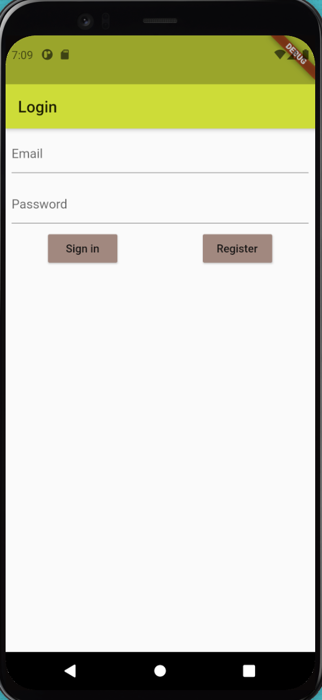
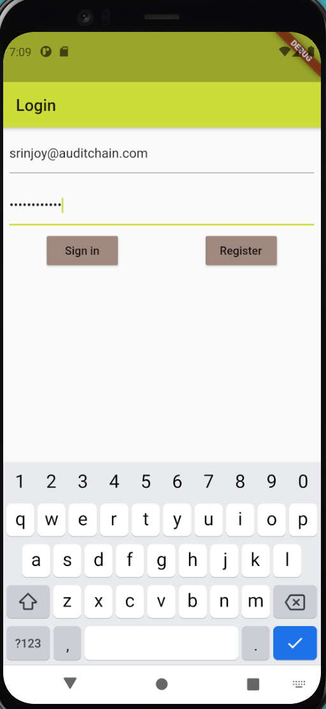
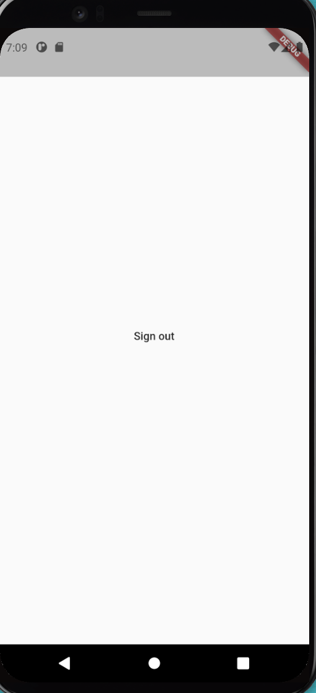
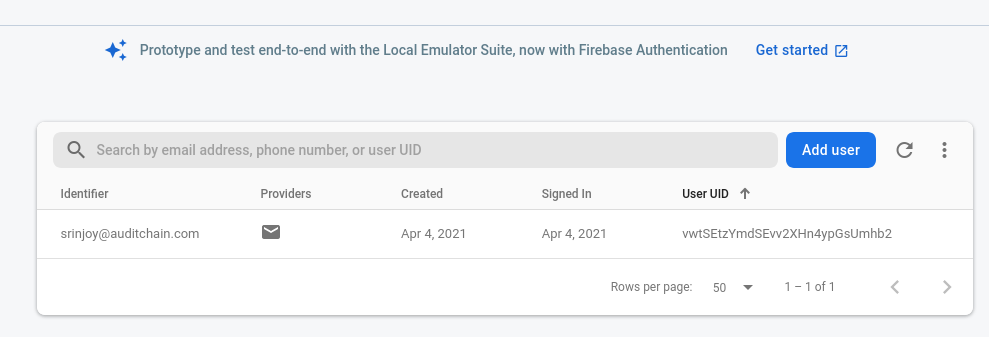
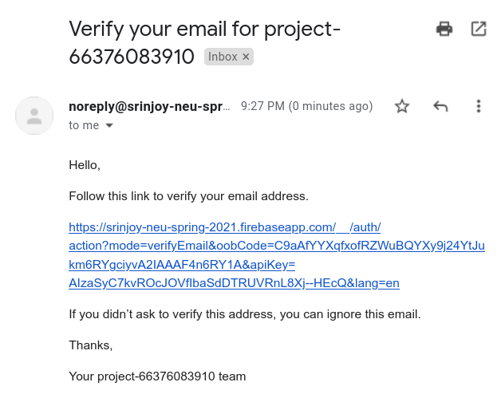
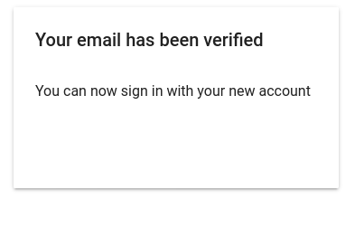

# android_register

Registering users on Android

## Getting Started

```bash
$ flutter clean
$ flutter upgrade
$ flutter pub get
$ flutter run
```

<br/>
<br/>

   
   > App on pre registration page
<br/>
<br/>

<br/>
<br/>

   
   > User fills in registration details
<br/>
<br/>

<br/>
<br/>

   
   > App logs user in and displays logout button
<br/>
<br/>

<br/>
<br/>

   
   > Google Firestore lists signed up user email
<br/>
<br/>

<br/>
<br/>

   
   > App notifies user that email confirmation is sent
<br/>
<br/>

<br/>
<br/>

   
   > Confirmation link is received on user's inbox via smtp
<br/>
<br/>

<br/>
<br/>

   
   > Email is successfully validate on hyperlink being clicked
<br/>
<br/>

<br/>
<br/>